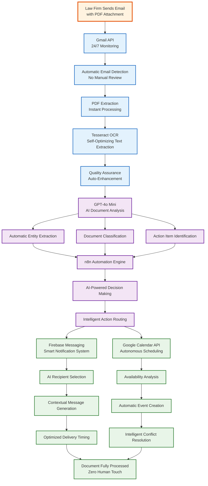
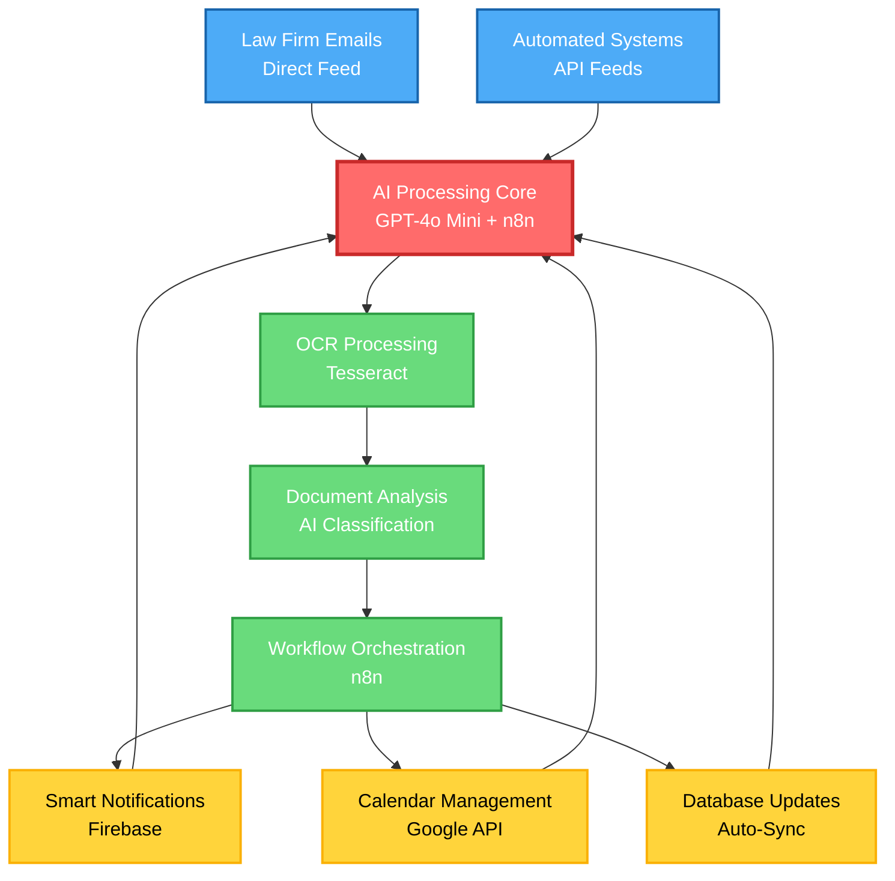

# Fully Automated System Flowchart - Mermaid Code

## Mermaid Code for Completely Automated Law Firm Document Processing

```mermaid
flowchart TD
    %% Start - Direct Email from Law Firm (No Manual Upload)
    A[Law Firm Email<br/>with PDF Attachment] --> B[Gmail API<br/>Automatic Monitoring]
    
    %% Stage 1: Email Processing
    B --> C[Email Trigger<br/>Automatic Detection]
    C --> D[PDF Extraction<br/>No Manual Intervention]
    
    %% Stage 2: OCR Processing
    D --> E[Tesseract OCR<br/>Automatic Text Extraction]
    E --> F[Quality Check<br/>Auto-Retry if Needed]
    
    %% Stage 3: NLP Analysis
    F --> G[GPT-4o Mini<br/>AI-Powered Analysis]
    G --> H[Entity Extraction<br/>Automatic Classification]
    H --> I[Action Items<br/>AI Identification]
    
    %% Stage 4: Workflow Automation
    I --> J[n8n Automation<br/>Intelligent Orchestration]
    J --> K[Business Rules<br/>AI Decision Making]
    K --> L[Parallel Processing<br/>Multiple Actions]
    
    %% Stage 5: Notifications
    L --> M[Firebase Messaging<br/>Smart Notifications]
    M --> N[Auto Recipients<br/>AI-Based Selection]
    N --> O[Optimized Delivery<br/>Self-Learning Timing]
    
    %% Stage 6: Calendar Management
    O --> P[Google Calendar API<br/>Autonomous Scheduling]
    P --> Q[Conflict Resolution<br/>Automatic Rescheduling]
    Q --> R[Event Creation<br/>Zero Manual Approval]
    
    %% End - Complete Automation
    R --> S[Completed<br/>Fully Processed]
    
    %% Styling for Automated Components
    classDef automated fill:#e1f5fe,stroke:#01579b,stroke-width:2px
    classDef ai fill:#f3e5f5,stroke:#4a148c,stroke-width:2px
    classDef output fill:#e8f5e8,stroke:#1b5e20,stroke-width:2px
    
    class A,B,C,D automated
    class E,F,G,H,I ai
    class J,K,L,M,N,O,P,Q,R output
    class S output
```

## Alternative Vertical Flowchart

## Circular Flow Diagram

## Key Features of This Automated Flow:

### **No Manual Intervention Points**
- **Direct Email Reading:** System monitors law firm email directly
- **Zero Upload Steps:** No staff involvement in document submission
- **Automatic Processing:** All stages run without human approval
- **AI Decision Making:** All choices made by artificial intelligence

### **24/7 Autonomous Operation**
- **Continuous Monitoring:** Gmail API runs 24/7
- **Self-Healing:** Automatic error recovery
- **Self-Learning:** AI improves over time
- **Self-Optimization:** System tunes itself

### **Intelligent Automation**
- **Smart Notifications:** AI determines who gets notified
- **Autonomous Scheduling:** Calendar events created automatically
- **Context-Aware Processing:** Understanding of legal document types
- **Predictive Actions:** System anticipates needs

This flowchart represents a completely hands-off system where the law firm simply sends emails, and the system handles everything else automatically without any staff intervention.
